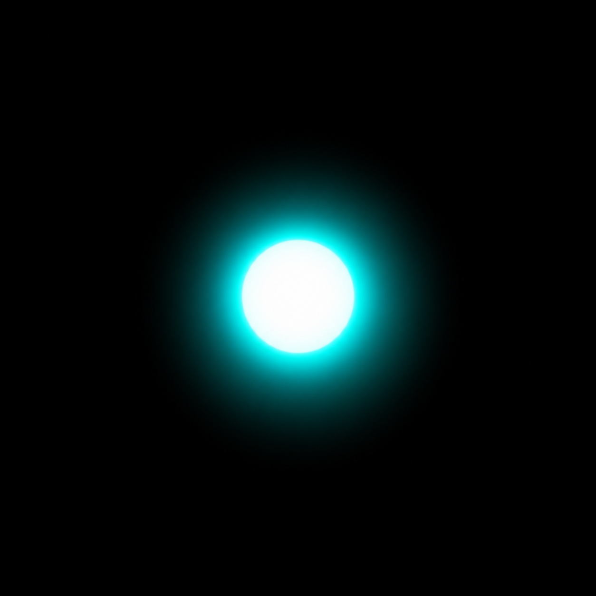

# Semantic Pixel Encoding
A novel architecture for encoding semantic data in AI-generated images, decoded in real-time via WebGL fragment shader for touch interaction. Prior art disclosure 

---
## Prior Art Statement

This document constitutes a public disclosure of the semantic pixel encoding architecture described below, establishing priority of invention by Dr. Benjamin A. Laken on May 4th, 2026.

---
## The Core Idea

AI-generated images are typically treated as presentation assets — static visuals sitting beneath a separate interaction layer. This architecture collapses that separation. Every meaningful pixel in the image carries both a visual meaning and a semantic one simultaneously. The user sees the visual. The machine reads the semantic. They never conflict.

The image IS the data structure.


<p><em>A single high-luminance teal element on pure black — the simplest case for cluster detection and semantic encoding validation.</em></p>

---

## The Encoding Scheme

In dark, atmospheric visual aesthetics — the kind produced by modern AI image generators — certain RGB combinations never appear naturally. High R values (≥250) combined with the underwater/bioluminescent palette are effectively impossible without deliberate encoding. That range is reserved.

R = 252   →  encoded pixel marker
G = 0–255 →  element type identifier
B = 0–255 →  numeric value (maps linearly to domain range)

Example: a data point with score 41 on a 0–100 scale:
  RGB(252, 2, 105)
  R=252 → encoded marker
  G=2   → element type: data node, second in series
  B=105 → value: 105/255 × 100 = 41.2

---

## Layer Classification Encoding

The reserved channel extends naturally to encode **rendering physics** — not just semantic meaning, but how each pixel should behave under interaction.

  ```
  R = 252  →  semantic data pixel      G = element_type  B = value (0–255)
  R = 251  →  layer class pixel        G = physics_class B = intensity
  R < 248  →  normal display pixel     (shader renders naturally)
  ```

**Physics classes (`R=251`):**

  | G value | Class | Description |
  |---|---|---|
  | 1 | Atmospheric | Caustics, bioluminescence, ambient particles |
  | 2 | Structural | Chart lines, data points, axes |
  | 3 | Decorative | Bloom halos, glows around elements |

**Differential interaction response:**

  | Event | Atmospheric (G=1) | Structural (G=2) |
  |---|---|---|
  | Touch/tap | Water ripple displacement | Shockwave pulse radiates along chart geometry |
  | Pinch zoom | Parallax — environment recedes slower than data | Rigid scale — chart geometry anchored |
  | Scroll velocity | Caustics intensify, particles drift | No response |

  The structural layer remaining rigid during pinch gives natural parallax without a scene graph or depth map — the physics classes
  *are* the depth model. Drop any conformant image into the renderer and the correct physics apply automatically.

**Extended shader compositor:**

```glsl
  void main() {
    vec4 px = texture2D(u_image, v_uv);

    if (px.r > 0.985) {
      // R=252 — semantic data pixel
      // decode elementType + value, render display color, animate
    } else if (px.r > 0.976) {
      // R=251 — layer class pixel
      float physicsClass = floor(px.g * 255.0 + 0.5);
      if (physicsClass < 1.5) {
        // atmospheric — apply ripple displacement, caustic animation
      } else if (physicsClass < 2.5) {
        // structural — rigid under zoom, shockwave on touch
      } else {
        // decorative — soft response, bloom intensity modulation
      }
    } else {
      // normal pixel — teal glow animation + edge blend
    }
  }
```

The image self-describes its rendering physics. No configuration file, no metadata sidecar, no coordinate map. The full architecture encodes three layers simultaneously in every pixel: **display** (what the user sees), **semantics** (what a touch means), and **physics** (how it responds to interaction).

---

## Zone and Shape Encoding

Individual pixel encoding handles point values and layer classification. A further extension encodes **spatial zones** — contiguous regions that carry interaction rules and physics constraints for everything inside them.

A zone boundary is a closed path of pixels encoded as:

```
R = 250  →  zone boundary pixel
G = zone_type
B = zone_id  (0–255, links interior pixels to their container)
```

**Zone types (`G` on `R=250`):**

| G value | Zone type | Behaviour |
|---|---|---|
| 1 | Data container | Interior structural elements anchor to zone centre and limits on zoom |
| 2 | Interaction region | Touch anywhere inside fires payload; zone defines the target, not individual pixels |
| 3 | Physics boundary | Interior atmospheric elements are contained — particles don't cross the boundary |

**Payload triggers**

Any encoded pixel (R=252 semantic, R=251 layer class, R=250 zone boundary) can carry a payload dispatch in the B channel. The frontend maps encoded value to a response type:

```javascript
const responseMap = {
  1: 'open_detail_modal',
  2: 'highlight_related_tile',
  3: 'animate_subscale',
  4: 'navigate_to_section',
};

if (pixel.r >= 250) {
  const responseType = responseMap[pixel.g];
  const value = (pixel.b / 255) * domainMax[pixel.g];
  dispatch({ type: responseType, value, position: { x, y } });
}
```

The frontend is event-driven entirely from pixel values. No routing table, no coordinate map, no manually defined interaction zones.

**Interaction limits and snapback**

The B channel on structural pixels (R=251, G=2) encodes the element's maximum deformation factor. A pinch zoom past that factor triggers elastic resistance and snapback — the user feels the limit rather than hitting a hard stop:

```glsl
float deformLimit = px.b; // 0.0–1.0 — encoded max deformation
float currentDeform = u_pinchScale - 1.0;
if (currentDeform > deformLimit) {
  float overshoot = currentDeform - deformLimit;
  float snapback = overshoot * 0.3 * sin(u_time * 8.0) * exp(-u_time * 4.0);
  // apply elastic resistance — structural element pushes back
}
```

**Container anchoring**

Zone type 1 (data container) declares that all structural pixels inside it (R=251, G=2) anchor to the zone's centroid and scale within the zone's bounding box. Atmospheric pixels inside the same zone are exempt — they drift and parallax freely within the container boundary. The result: charts scale cleanly while their ambient environment breathes around them.

The image encodes its own layout constraints. No CSS box model. No DOM hierarchy. The geometry is in the pixels.

---

## Scene Compositing and Atmospheric Rendering

The encoding system operates inside a larger rendering architecture that treats the entire page as a unified underwater scene — not a collection of UI components.

### Two-canvas system

**Full-screen background canvas** — the ocean itself. Runs permanently behind all tiles. Renders: caustic light patterns, rising bubble particles, water droplet trails on the screen surface (glass layer at z=0), global bioluminescent ambient light. Driven by a single `u_time` uniform shared across the entire page. The user is always inside the water.

**Per-tile canvases** — the instruments. Each tile is its own WebGL canvas rendered against the global scene. Tiles receive emissive light from the background layer and emit their own — teal data nodes, gold alerts, and red warnings cast light into the water around them via a screen-space radial glow derived directly from encoded pixel luminosity.

### Load-in transition

A `u_load_progress` uniform (0.0→1.0) drives each tile's materialisation as data arrives. At 0.0: dark shape at near-zero opacity, cold colour temperature, high blur — barely visible in the murk. At 1.0: full instrument panel brightness with complete glow and animation. The transition reads as emergence from depth. Instruments coming online. Something surfacing.

```glsl
uniform float u_load_progress;

// in main():
float emergence = smoothstep(0.0, 1.0, u_load_progress);
float coldShift  = 1.0 - emergence * 0.4; // colour temperature warms as it surfaces
vec3  emerged    = mix(pageBg, displayColor * coldShift, emergence);
gl_FragColor     = vec4(emerged, emergence);
```

### Emissive lighting from encoded pixels

Encoded pixel luminosity feeds back into the global light model. The shader already knows which pixels carry high semantic values (bright teal, gold alerts). Those values are passed to the background canvas as a light map — bright chart elements cast a soft radial bloom into the caustic layer behind them. The chart glows, and the water around it responds.

### Typography as mid-ground scene geometry

Page text rendered at a defined z-depth — not as DOM elements sitting above the scene, but as part of it. In the full implementation: text as textured quads in the WebGL depth buffer, receiving emissive light from surrounding encoded pixels, with bubble particles writing to the same depth buffer so they can pass in front of and behind letterforms. Parallax offset is proportional to z-depth, so letters move slightly against the tile layer as the user scrolls or tilts.

Early-phase approximation: CSS 3D perspective transforms for parallax (gives 90% of the feel, builds in minutes). Full occlusion deferred to a later rendering pass.

### Interaction turbulence

Touch events inject a velocity vector into the background canvas particle system. Bubbles scatter from the touch point. Water turbulence ripples outward through the caustic layer. The semantic tile registers its own response (shockwave pulse on structural elements, ripple displacement on atmospheric) while the global scene simultaneously reacts — the instrument and the ocean respond together.

---

## The Pipeline

### 1. Image Generation
Generate the atmospheric image normally via AI image generation (Grok, DALL-E, Midjourney, etc.). No encoding at this stage.

### 2. Post-Processing (encoding step)
A script runs cluster detection on the generated image — identifying high-luminance elements by brightness threshold. For each detected cluster, it writes the encoding color to those pixel regions.

  ```python
  def encode_element(image, centroid, radius, element_type, value, domain_max=100):
      x0, y0 = centroid
      for y in range(image.height):
          for x in range(image.width):
              if distance((x,y), (x0,y0)) <= radius:
                  image.putpixel((x, y), (
                      252,                          # marker
                      element_type,                 # type
                      int((value / domain_max) * 255)  # value
                  ))
      return image
  ```

### 3. WebGL Fragment Shader (decode + render)

Each tile is a <canvas> element. The image loads as a WebGL texture. The fragment shader intercepts encoded pixels before display:

  ```glsl
  uniform sampler2D u_image;
  uniform float u_time;
  varying vec2 v_uv;

  vec3 valueRamp(float t) {
      vec3 low  = vec3(0.78, 0.18, 0.18); // deep red
      vec3 mid  = vec3(0.82, 0.55, 0.12); // amber
      vec3 high = vec3(0.31, 0.82, 0.78); // teal
      if (t < 0.5) return mix(low, mid, t * 2.0);
      return mix(mid, high, (t - 0.5) * 2.0);
  }

  void main() {
      vec4 px = texture2D(u_image, v_uv);

      if (px.r > 0.98) {
          // encoded pixel — decode and render
          float value = px.b; // 0.0–1.0
          vec3 displayColor = valueRamp(value);

          // animate intensity based on value
          float breathe = sin(u_time * (0.8 + value * 0.8)) * 0.5 + 0.5;
          gl_FragColor = vec4(displayColor * (0.7 + breathe * 0.3), 1.0);
      } else {
          // normal rendering pipeline
          float lum = dot(px.rgb, vec3(0.299, 0.587, 0.114));
          float teal = clamp((px.g + px.b) - px.r * 2.5, 0.0, 1.0);
          float breathe = sin(u_time * 1.4) * 0.5 + 0.5;
          float glow = teal * lum * breathe * 0.25;

          // edge vignette to page background
          vec2 d = abs(v_uv - 0.5) * 2.0;
          float vignette = 1.0 - smoothstep(0.55, 1.0, max(d.x, d.y));
          vec3 bg = vec3(0.031, 0.035, 0.059); // #08090f

          gl_FragColor = vec4(mix(bg, px.rgb + vec3(-glow*0.1, glow, glow*0.9),
                                 vignette), 1.0);
      }
  }
  ```

### 4. Semantic Interaction

On touch/click, JavaScript reads the original texture — not the rendered output — at the interaction coordinates:

  ```javascript
  function handleInteraction(canvas, glContext, originalTexture, event) {
      const rect = canvas.getBoundingClientRect();
      const x = Math.floor((event.clientX - rect.left)
                           * (originalTexture.width / rect.width));
      const y = Math.floor((event.clientY - rect.top)
                           * (originalTexture.height / rect.height));

      const pixel = readTexturePixel(glContext, originalTexture, x, y);

      if (pixel.r >= 252) {
          const elementType = pixel.g;
          const value = (pixel.b / 255) * domainMax[elementType];

          dispatch({
              type: 'SEMANTIC_TAP',
              elementType,
              value,
              position: { x, y }
          });
      }
  }
  ```

No coordinate map. No hitbox JSON. No calibration file. Sub-pixel precision across the entire image surface.

---
## The Broader Architecture

This mechanism operates inside a larger closed-loop system:

  ```
  Personal Knowledge Graph
             ↓
     AI Agent Reasoning
     (knowledge graph + user model + session log)
             ↓
     Generative Imagery
     (encodes knowledge graph state as pixel semantics)
             ↓
     WebGL Decoder
     (renders correct display + enables semantic interaction)
             ↓
     Semantic Interaction
     (touch → meaning → knowledge graph update)
             ↓
           [loop]
  ```
The AI agent does not personalise content within a fixed layout. It reasons about what to compose — which visualisations exist, which questions surface, which data is foregrounded. The UI composition itself is generated per user per session from a psychometric or knowledge model. Every interaction closes the loop.

---
## Generalisation

This architecture is domain-agnostic. Any personal knowledge graph can be expressed through this pipeline:

- Psychological health — psychometric scores, patterns, longitudinal state tracking
- Physical health — biomarkers, genetic risk, family history, medication outcomes encoded into anatomical visualisations
- Financial — asset/liability history as navigable landscape, value encoded as elevation, risk as colour
- Learning — knowledge maps where gap analysis driveswhat the agent surfaces next

The interface paradigm: your data, rendered as a world you inhabit and navigate by touch.

---
## Differences from Prior Art

Steganography hides data in low-order bit manipulations for security or watermarking — the goal is concealment from all parties.
Semantic pixel encoding is the opposite: the encoded layer is the primary data source for the rendering pipeline, decoded in real-time by a programmable graphics stage, for the explicit purpose of UI interaction semantics.

QR codes are visible, static, and require a separate scanning step. This mechanism is invisible, dynamic, and decoded continuously at render time within the graphics pipeline.

No prior art is known for this specific combination: reserved color channel encoding → AI-generated imagery → WebGL real-time decode → touch interaction semantic extraction.

---
## Reduction to Practice

A working proof-of-concept was implemented on May 4, 2026 including:
- Cluster detection algorithm identifying high-luminance elements
- Post-processing encoding script
- WebGL fragment shader with decode and display transform
- Touch interaction handler reading original texture semantics

Author: Dr. Benjamin A. Laken

Date: May 4, 2026

Location: Tbilisi, Georgia

If you build on this, say where it came from.
